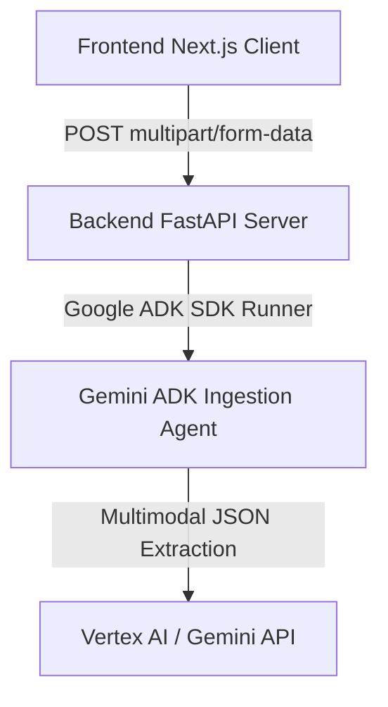

# 🔮 do-aiparser: Premium Multimodal AI Document Parsing Monorepo

`do-aiparser` is a high-fidelity, Apple-style minimalist web application designed to ingest store invoices, bills, vouchers, forms, and receipts (in both PDF and Image formats) and automatically extract structured data via the **Google Agent Development Kit (ADK)** and `gemini-2.5-flash`.

---

## 🗺️ Architecture & Repository Layout

This repository is structured as an isolated monorepo dividing frontend client presentation from intelligent backend AI extraction:



### Component Layout
* **`apps/frontend/`**: Next.js v15+ web app built via App Router, styled using vanilla Tailwind CSS v4, offering custom dropzones, interactive badges, and a code-editor-style JSON view canvas.
* **`apps/backend/`**: Python v3.11+ FastAPI server utilizing `uv` package orchestration, exposing endpoints powered by programmatic ADK Agents.
* **`test-data/`**: High-resolution sample mock receipt files used for integration checks and OCR data verification.

---

## 🚀 Production Live Testing Links

The services are fully containerized and live-deployed on **Google Cloud Run** via automated GitHub Actions monorepo orchestration pipelines. You can access the public environments directly:

> [!NOTE]
> **Yes! The Backend API is fully testable by you/users directly!** We have attached a public invoker policy to the Cloud Run instance so you can query the endpoints directly in bash via `curl`, or use the interactive web playground documentation.

* **Frontend Dashboard UI**: [https://docompare-frontend-388889235558.us-central1.run.app](https://docompare-frontend-388889235558.us-central1.run.app) — Elegant Apple-style droppable dashboard to upload invoices and interactively view color-coded JSON schemas.
* **Backend API Endpoint**: `POST` [https://docompare-388889235558.us-central1.run.app/api/extract](https://docompare-388889235558.us-central1.run.app/api/extract) — The primary `multipart/form-data` route that parses documents and maps dynamic user tags in-process.
* **Backend ADK Web Console (Swagger UI)**: [https://docompare-388889235558.us-central1.run.app/docs](https://docompare-388889235558.us-central1.run.app/docs) — Interactive web playground documentation to inspect full schema JSON specifications and trigger test requests natively from your browser.

---

## 🛠️ Local Development & Command Reference


### 1. 🤖 Backend Development (`apps/backend/`)
Before launching, configure your GCP credentials and environment settings inside `.env.local`.

* **Interactive Agent Playground**:
  Test and play with your Gemini ADK extraction prompt and schemas in the interactive web playground:
  ```bash
  cd apps/backend
  agents-cli playground
  ```
* **Launch the Web Server App**:
  Start the production-ready FastAPI API backend:
  ```bash
  ./start-backend.sh
  ```
* **Run Standalone Script Validation**:
  Run a stateless, isolated execution of the receipt parser against test files:
  ```bash
  uv run python tests/test_agent_standalone.py
  ```

### 2. 🎨 Frontend Dashboard (`apps/frontend/`)
* **Start Next.js UI Client**:
  Launches the minimalist web dashboard on `http://localhost:3000`:
  ```bash
  ./start-frontend.sh
  ```

---

## 🧪 Test Suite & Quality Metrics

We maintain an automated testing pipeline to guarantee extraction latency, correct structured JSON boundaries, and support for user-defined **Custom dynamic tags**:

```bash
# From your monorepo root path
./test-backend.sh
```

This script automatically:
1. Assesses API server status.
2. Verifies standard schema extractions.
3. Injects dynamic extractions (e.g. `expense_category` classification or corporate eligibility flags).
4. Assures structured telemetry records are written smoothly into `apps/backend/extraction.log`.
