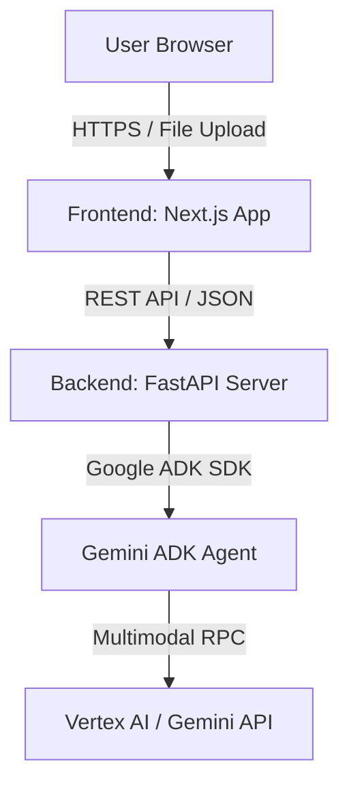

# 📝 Functional & Technical Specifications: do-aiparser

This document serves as the definitive single source of truth for the architecture, APIs, model configurations, and data models of the **do-aiparser** project.

---

## 1. System Architecture

`do-aiparser` is structured as a unified monorepo consisting of two separate, isolated applications:



### Component Directory Layout
- **`apps/frontend/`**: Next.js v15+ App Router web application (React, TypeScript, Tailwind CSS v4, Radix, Shadcn UI).
- **`apps/backend/`**: Python v3.11+ FastAPI web framework utilizing `uv` for lightning-fast package management and the Google Agent Development Kit (ADK).

---

## 2. AI Core: Gemini & Google ADK

### Model Selection
- **`gemini-2.5-flash`** (or **`gemini-3.1-flash-preview`** based on standard sandbox constraints): Selected for its superior multimodal capabilities (handling images and complex text dense PDFs), massive context window, and exceptionally fast execution speeds suitable for structured JSON output extraction.

### Google ADK Integration
The backend will implement an ADK Agent configured with explicit playbooks for structured information retrieval.
- **System Instructions**: Configured to act as a world-class data extraction specialist. It will accept an image/PDF alongside an expected JSON target schema and return exact data without preamble or explanations.
- **Structured Output Constraints**: Leverage `response_mime_type="application/json"` and strict `response_schema` definitions to ensure total reliability.

---

## 3. Data Schema Specifications

Extraction is divided into **Standard Fields** and **Dynamic User-Defined Fields**.

### Standard Target JSON Schema
```json
{
  "merchant": {
    "name": "string",
    "address": "string or null",
    "phone": "string or null",
    "website": "string or null"
  },
  "transaction": {
    "date": "YYYY-MM-DD or null",
    "time": "HH:MM:SS or null",
    "invoice_number": "string or null"
  },
  "financials": {
    "currency": "string (e.g., USD, MYR, EUR)",
    "subtotal": "number (float)",
    "tax_amount": "number (float)",
    "service_charge": "number (float or null)",
    "discount": "number (float or null)",
    "total_amount": "number (float)"
  },
  "payment": {
    "method": "string (e.g., Cash, Credit Card, Visa, Debit, Amex or null)",
    "card_last_4": "string or null"
  },
  "line_items": [
    {
      "description": "string",
      "quantity": "number (int or float)",
      "unit_price": "number (float)",
      "total_price": "number (float)"
    }
  ]
}
```

### Dynamic Custom Fields
When the user requests extra fields, the frontend will send a dictionary of descriptors:
```json
{
  "is_business_expense": "Boolean indicating if this item belongs to a business meal or corporate travel",
  "project_code": "Any text like PROJ-XYZ or similar billing code found on the invoice",
  "expense_category": "Deduce if this is Food, Lodging, Software, Transport, or Utilities"
}
```
The ADK agent appends these fields into an extension block called `custom_extra_fields` in the final JSON payload response.

---

## 4. API Endpoints Blueprint

### `POST /api/extract`
Primary endpoint called by the frontend to upload files and trigger intelligent extraction.

- **Content-Type**: `multipart/form-data`
- **Form Parameters**:
  - `file`: Binary image (PNG, JPEG, WebP) or PDF document.
  - `custom_fields`: A stringified JSON object detailing extra fields to look for.

- **Response (200 OK)**:
```json
{
  "success": true,
  "session_id": "string-uuid",
  "timestamp": "ISO-8601-timestamp",
  "data": {
    "merchant": { ... },
    "transaction": { ... },
    "financials": { ... },
    "payment": { ... },
    "line_items": [ ... ],
    "custom_extra_fields": {
      "is_business_expense": true,
      "project_code": "PROJ-888",
      "expense_category": "Software"
    }
  }
}
```

---

## 5. UX/UI Design Blueprint (from UX.md)

Following the **Apple-Style Minimalism** specification:
1. **The Dropzone Dashboard**: A sleek, high-contrast home screen (`#F5F5F7`) featuring a clean file dropzone using a subtle `bg-white/80` glass card.
2. **Dynamic Fields Drawer**: A sidebar or expandable sheet where users can dynamically add custom key-value tags for fields they want to pull out.
3. **Split View Comparison Canvas**: Once extracted, the interface splits into:
   - **Left Pane**: A premium zoomable/scrollable view of the uploaded receipt/invoice.
   - **Right Pane**: A rich code-editor-style JSON block with syntax highlighting and a one-click copy button, alongside formatted glass badges highlighting total cost, merchant name, and custom tags.
